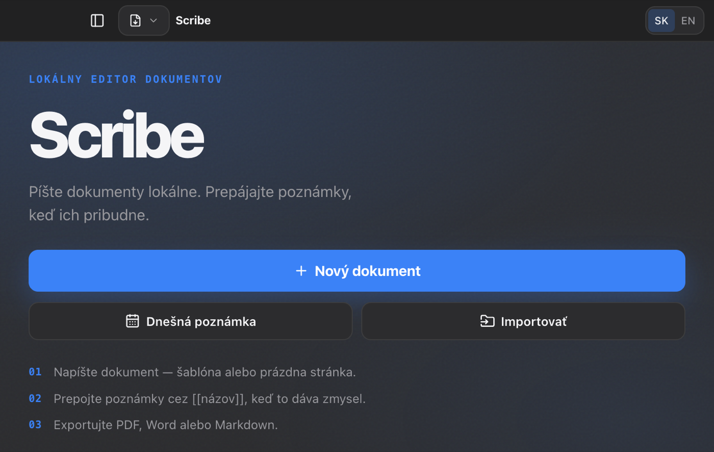
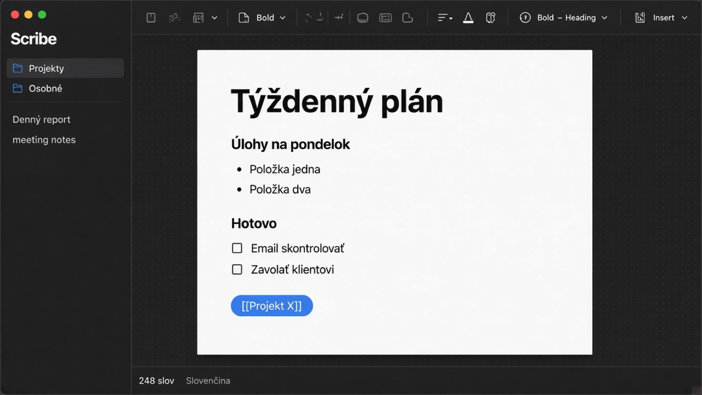
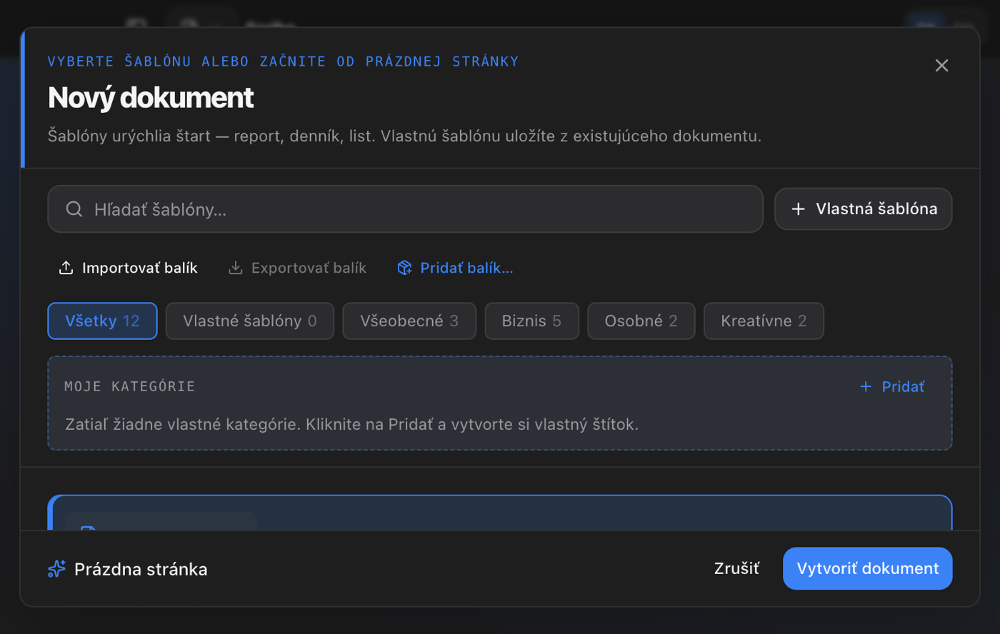
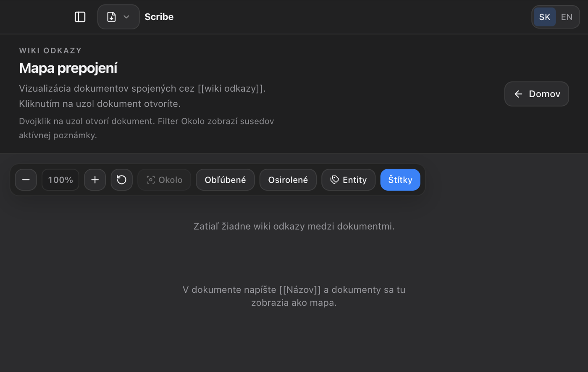
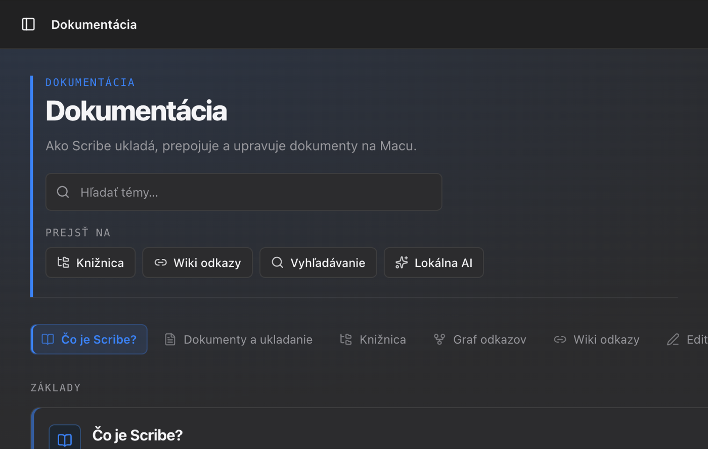
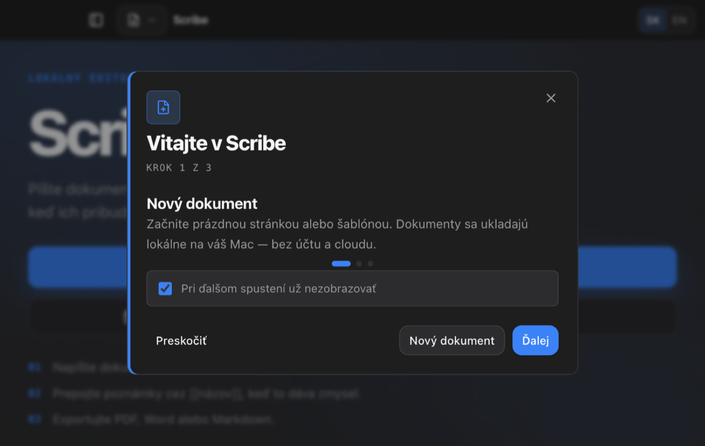
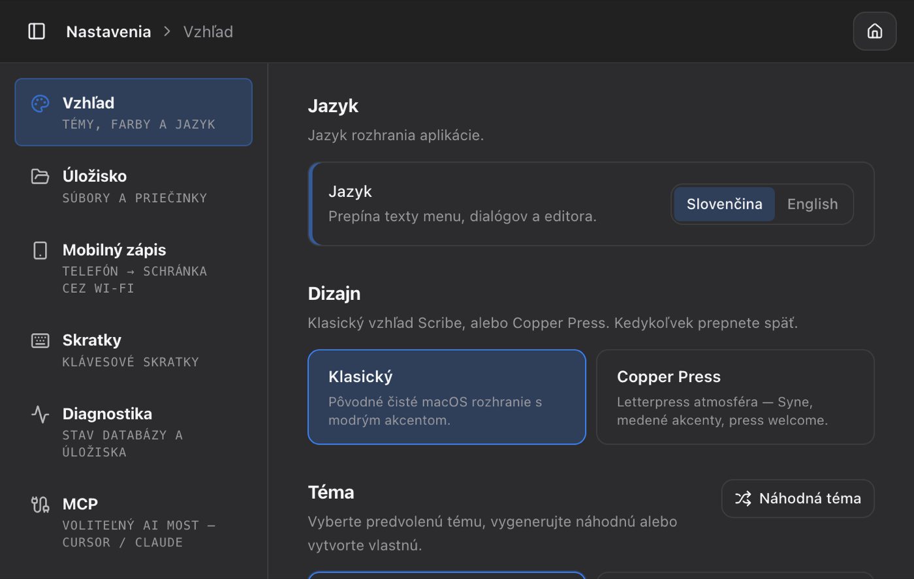
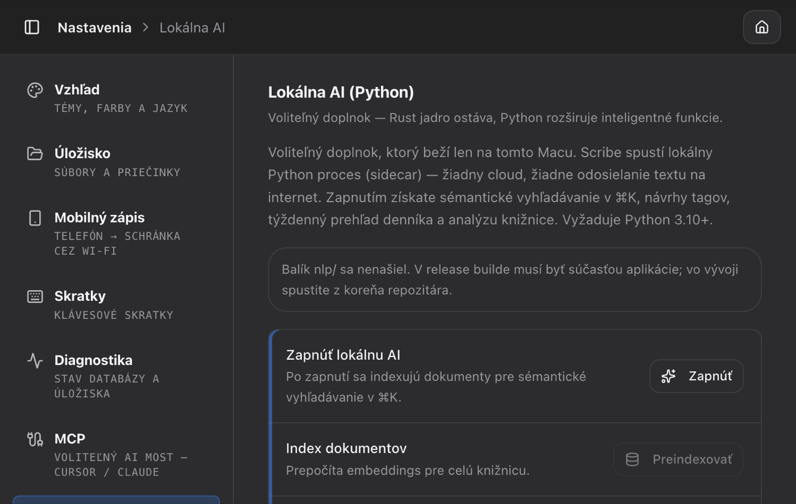
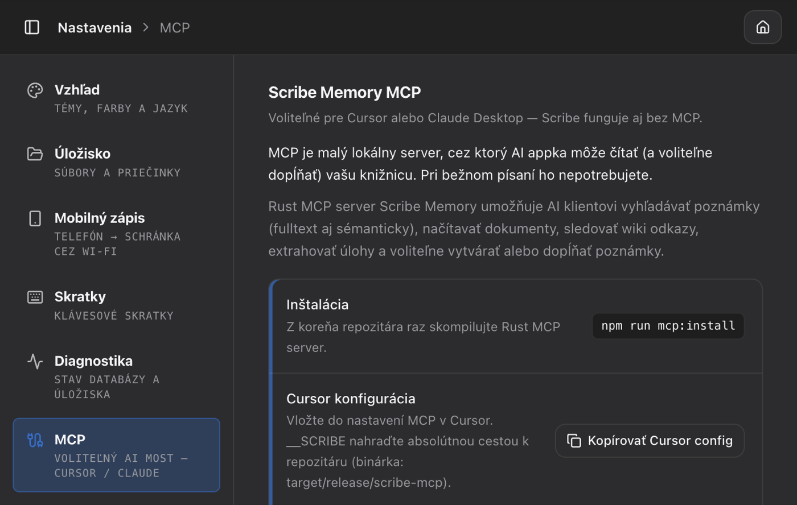

# Scribe 2.3

<p align="center">
  
</p>

Píšte dokumenty. Prepájajte poznámky. **Scribe 2.3** je lokálny macOS rich-text editor s knižnicou, šablónami a exportom do viacerých formátov.

Scribe beží lokálne na vašom Macu. Žiadne účty, žiadny cloud — dokumenty, databáza a nastavenia patria používateľovi macOS účtu, v ktorom je aplikácia spustená.

**Jazyky:** [English](README.md) · [Slovenčina](README.sk.md)

## Screenshoty

<p align="center">
  
</p>

<p align="center"><em>Domov — nový dokument, dnešná poznámka, import</em></p>

<p align="center">
  
</p>

<p align="center"><em>Editor — print layout, knižnica, wiki odkazy</em></p>

<p align="center">
  
</p>

<p align="center"><em>Šablóny — prázdna stránka, canvas, report, faktúra a ďalšie</em></p>

<p align="center">
  
</p>

<p align="center"><em>Mapa prepojení — wiki odkazy medzi poznámkami</em></p>

<p align="center">
  
</p>

<p align="center"><em>Dokumentácia — knižnica, wiki, Lokálna AI, zálohy</em></p>

<p align="center">
  
</p>

<p align="center"><em>Vitajte v Scribe — prvý štart</em></p>

<p align="center">
  
  &nbsp;
  
</p>

<p align="center"><em>Nastavenia — Vzhľad · Lokálna AI</em></p>

<p align="center">
  
</p>

<p align="center"><em>Nastavenia — voliteľný MCP most pre Cursor / Claude</em></p>

## Funkcie

### Editor
- Rich-text editor postavený na **TipTap** / ProseMirror
- Prepínanie medzi formátovaným textom a **Markdown** zdrojákom
- Formátovanie: nadpisy, zoznamy, checklisty, tabuľky, obrázky (popisok, [React Image Crop](https://github.com/dominictobias/react-image-crop), full-width), odkazy, poznámky pod čiarou
- Slash príkazy (`/`), bubble menu, drag & drop blokov a obrázkov; priečinky knižnice a karty editora cez React DnD
- Blokové **snipety** cez slash (meeting notes, decision, …)
- Wiki odkazy (`[[dokument]]`), embedy (`![[dokument]]`), komentáre, matematika (math.js), Mermaid diagramy, D3 grafy (JSON špecifikácia: stĺpcový / čiarový / area / koláč), videá (React Player), mapy (React Leaflet / OpenStreetMap), code bloky (React Syntax Highlighter)
- **Print layout** — stránkovaný náhľad s okrajmi, hlavičkami/pätami, vodotlačou; jemný hero na prázdnej stránke
- **Režim sústredenia** — minimal UI pre nerušené písanie (`⌘⇧F`, ukončenie cez `Esc`)
- **Canvas poznámky** — voľné karty a spojenia (`type: canvas`) na [React Flow](https://reactflow.dev/)

### Knižnica
- Stromová štruktúra **priečinkov** s drag & drop
- Fulltextové vyhľadávanie dokumentov (**SQLite FTS5**)
- Obľúbené, kôš s toastom **Vrátiť**, nedávne dokumenty, **denné poznámky** s calendar heat map
- **Týždenný digest** — súhrn z denníka/NLP do dokumentu (`⌘K`)
- **Nájsť a nahradiť** v celej knižnici cez TipTap text (`⌘⇧H`)
- **Mapa prepojení** (`/graph`): lokálny graf (dvojklik na uzol), filtre, farby podľa tagu/priečinka
- Panel backlinkov + **unlinked mentions**
- Príkazová paleta (`⌘K`) s fuzzy matchingom, nedávnymi dokumentmi a wiki cieľmi
- **Pripnuté taby** — dokumenty ostanú otvorené, kým ich neodopneš
- Voliteľný MCP most pre AI nástroje (Cursor / Claude) — Nastavenia → MCP; pozri [`crates/scribe-mcp/`](crates/scribe-mcp/)
- Voliteľná **Lokálna AI** (Python sidecar **0.8**): sémantické hľadanie, zhrnutie, kľúčové slová/osnova/tón/dátumy, duplikáty, denníkový digest, analýza knižnice, kontrola pravopisu — pozri nižšie a [`nlp/README.md`](nlp/README.md)

### Dokumenty
- Vlastný formát **`.scribe`** + synchronizácia na disk
- Šablóny (report, list, životopis, faktúra, esej, …) plus **balíky šablón** (import/export `.scribe-templates.json`, SK balíky)
- Import: `.scribe`, `.pages`, `.md`, `.txt`, `.docx`, `.rtf`, `.doc`
- Export: **PDF**, **DOCX**, **Markdown**, **TXT**, **Pages**; export **výberu** do MD/PDF
- **Share balík** — lokálne PDF alebo HTML-ZIP otvorené vo Finderi (vhodné na AirDrop; bez cloud hostingu)
- **Auto-sync** priečinka, ak dokumenty ležia v iCloud Drive / Dropboxe (tip pre viac Macov v Nastaveniach)
- Automatické ukladanie a **história verzií** s porovnaním diff

### Vzhľad a nastavenia
- Svetlá / tmavá / systémová téma + vlastné farby
- Náhodná generácia témy
- Konfigurovateľný priečinok dokumentov
- **Jazyk rozhrania:** slovenčina alebo angličtina (Nastavenia → Vzhľad → Jazyk)
- Voliteľný **MCP setup** v Nastaveniach (pre pokročilých)

## Tech stack

| Vrstva | Technológia |
|--------|-------------|
| Desktop shell | [Tauri 2](https://v2.tauri.app/) (Rust) + pluginy: dialog, fs, opener, [persisted-scope](https://v2.tauri.app/plugin/persisted-scope/), [positioner](https://v2.tauri.app/plugin/positioner/), [global-shortcut](https://v2.tauri.app/plugin/global-shortcut/) |
| Frontend | React 19, TypeScript, Vite 8 |
| Editor | TipTap 3 (ProseMirror) |
| UI | Tailwind CSS v4, Radix UI, shadcn-style komponenty |
| Routing | TanStack Router |
| State | Redux Toolkit |
| i18n | i18next + react-i18next |
| Databáza | SQLite (rusqlite, WAL mode) |
| Lokálna AI | Python **3.10+** stdlib sidecar ([`nlp/`](nlp/)) — voliteľne `sentence-transformers` |
| Mobile (iOS/Android) | [`@tauri-apps/plugin-barcode-scanner`](https://v2.tauri.app/plugin/barcode-scanner/) — QR / čiarový kód → vložiť do poznámky |
| Testy | Vitest, Testing Library, `cargo test`, `nlp:test` |

## Požiadavky

- **macOS** (primárna cieľová platforma)
- [Bun](https://bun.sh/) alebo Node.js 20+
- [Rust](https://rustup.rs/) 1.77+
- Xcode Command Line Tools (pre Tauri build)
- **Python 3.10+** (`python3` v `PATH`) — len ak používate **Lokálnu AI**

## Spustenie

```bash
git clone <repo-url>
cd scribe
bun install
bun run tauri:dev
```

Alternatíva s npm:

```bash
npm install
npm run tauri:dev
```

Dev server beží na `http://localhost:5174`. Pri prvom spustení Tauri stiahne a skompiluje Rust závislosti — môže to trvať niekoľko minút.

## Skripty

| Príkaz | Popis |
|--------|-------|
| `bun run tauri:dev` | Spustí aplikáciu v dev režime (+ paralelne build MCP release binárky) |
| `bun run tauri:dev:debug` | To isté + Rust/NLP/frontend debug logy |
| `bun run tauri:dev:clean` | Dev režim s vyčisteným Vite cache |
| `bun run tauri:dev:app` | Len Tauri (bez MCP buildu) |
| `bun run tauri:dev:app:debug` | Len Tauri s debug env |
| `bun run tauri:build` | Produkčný build `.app` / inštalátora |
| `bun run build` | Len frontend build |
| `bun run dev` | Len Vite (prehliadač, bez Tauri IPC) |
| `bun run dev:debug` | Vite s `VITE_DEBUG=1` |
| `bun run test` | Frontend testy (Vitest) |
| `bun run test:backend` | Rust testy |
| `bun run test:all` | Frontend + Rust + NLP testy |
| `bun run lint` | ESLint |
| `npm run nlp:health` | Ping Lokálnej AI (JSON-RPC health) |
| `npm run nlp:debug` | Debug CLI Lokálnej AI (stderr timing + sample analyze) |
| `npm run nlp:test` | Python NLP unit testy |
| `npm run mcp:install` | Skompiluje Rust Scribe Memory MCP (`scribe-mcp`) |
| `npm run mcp` | Spustí MCP server (stdio, release) |
| `npm run mcp:debug` | MCP server (debug build + `RUST_LOG=debug`) |

## Lokálna AI (Python)

Voliteľná offline inteligencia. Zapnite v **Nastavenia → Lokálna AI**. Scribe spustí malý Python proces (`nlp/scribe_nlp/`) cez stdin/stdout JSON-RPC — text dokumentov **nikdy neopustí Mac**.

| | |
|--|--|
| **Runtime** | Python **3.10+**, predvolene len štandardná knižnica |
| **Verzia sidecaru** | **1.3.0** |
| **Predvolený embed model** | `scribe-hash-v4` (stem/diakritika; chunk mean-pool pre dlhé poznámky) |
| **Voliteľná kvalita** | `pip install sentence-transformers` → MiniLM (`scribe-minilm-v1`), cache v `~/.cache/scribe-nlp/models` |
| **Čo získate** | Sémantické ⌘K hľadanie, AI insights (zhrnutie, tón, dátumy, odkazy, kľúčové slová), návrhy tagov, denníkový digest, report knižnice, revision AI, kartičky, závery, terminológia, štýlový kouč |

```bash
# health check
npm run nlp:health

# unit testy (~50)
npm run nlp:test

# voliteľne lepšie embeddings
pip install 'sentence-transformers>=3'
# potom Nastavenia → Lokálna AI → quality backend + Preindexovať
```

Kompletný zoznam metód: [`nlp/README.md`](nlp/README.md). Po zmene modelu (napr. `v3` → `v4`) spustite **Preindexovať**.

## Debug režimy

| Vrstva | Príkaz / env | Čo dostanete |
|--------|--------------|--------------|
| Všetko | `npm run tauri:dev:debug` | Rust + NLP + Vite debug naraz |
| Frontend | `npm run dev:debug` alebo `VITE_DEBUG=1` | Console `[scribe-fe]` logy |
| Rust | `SCRIBE_RUST_LOG=debug` / `RUST_LOG=debug` / `SCRIBE_DEBUG=1` | Debug logy + NLP RPC stopy |
| NLP | `SCRIBE_NLP_DEBUG=1` alebo `npm run nlp:debug` | Sidecar stderr timing (stdout ostáva JSON-RPC) |
| MCP | `npm run mcp:debug` | Debug build `scribe-mcp` |

## Scribe Memory MCP (Claude / Cursor)

Voliteľná power funkcia: lokálne poznámky cez MCP pre Claude Desktop alebo Cursor. Bežné písanie MCP nevyžaduje. Server preferuje **zápis** (`create_note` / `append_to_note`) a pri zamknutej DB prejde do **read-only**. Šifrované **trezorové** poznámky sú predvolene vylúčené (`SCRIBE_MCP_SCOPE=no-vault`). In-app: **Nastavenia → MCP**.

- Prehľad: [`crates/scribe-mcp/README.md`](crates/scribe-mcp/README.md) · docs [`crates/scribe-mcp/docs/`](crates/scribe-mcp/docs/README.md)

```bash
npm run mcp:install
npm run mcp
```

## Úložisko dát

Scribe ukladá dáta lokálne na disk:

| Čo | Kde (predvolene) |
|----|------------------|
| SQLite databáza | `~/Library/Application Support/com.scribe.app/scribe.db` |
| Dokumenty (`.scribe`) | `~/Documents/Scribe/` |
| Obrázky dokumentov | `~/Documents/Scribe/assets/` |
| PDF exporty | `~/Documents/Scribe/pdf/` |

Priečinok dokumentov je možné zmeniť v **Nastavenia → Úložisko**. Aplikácia neimplementuje viacužívateľské účty — izolácia je na úrovni macOS používateľa.

## Preklady (i18n)

Preklady sú v:

```
src/i18n/
├── index.ts          # nastavenie i18next
└── locales/
    ├── en.json       # angličtina
    └── sk.json       # slovenčina (predvolená)
```

Ako pridať alebo zmeniť texty:

1. Pridajte kľúč do `en.json` aj `sk.json`
2. V React komponentoch použite `useTranslation()`: `t('settings.language.title')`
3. Mimo React importujte `i18n` z `@/i18n` a volajte `i18n.t(...)`

Zvolený jazyk sa ukladá do IndexedDB (`scribe-locale`) a mení sa v **Nastavenia → Vzhľad → Jazyk**.

Zatiaľ nie je preložené celé UI — najprv nastavenia, navigácia, dialógy úložiska a skratky. Nové obrazovky by mali od začiatku používať prekladové kľúče.

## Klávesové skratky

| Skratka | Akcia |
|---------|-------|
| `⌘N` | Nový dokument (šablóny) |
| `⌘S` | Uložiť |
| `⌘K` | Príkazová paleta |
| `⌘O` | Importovať súbor |
| `⌘F` | Hľadať v dokumente |
| `⌘H` | Hľadať a nahradiť (aktuálny dokument) |
| `⌘⇧H` | Hľadať a nahradiť v knižnici |
| `⌘Z` / `⌘⇧Z` | Späť / Znovu |
| `⌘⇧F` | Režim sústredenia |
| `⌘⇧L` | Prepínať tému |
| `⌘,` | Nastavenia |
| `Esc` | Ukončiť režim sústredenia |

Kompletný zoznam je v aplikácii pod **Nastavenia → Skratky**.

## Štruktúra projektu

Scribe je **local-first desktop app**: React UI komunikuje s Rust Tauri shellom, ktorý vlastní SQLite a voliteľnú Python Local AI. Voliteľný MCP proces môže čítať/zapisovať tú istú databázu pre Cursor / Claude.

```
┌─────────────────────────────────────────────────────────────┐
│  React UI (src/)                                            │
│  pages · components · Redux store · TipTap editor           │
│  lib/db/*  ──invoke()──►  Tauri commands                    │
└───────────────────────────────┬─────────────────────────────┘
                                │
┌───────────────────────────────▼─────────────────────────────┐
│  Tauri shell (src-tauri/)                                   │
│  IPC commands · storage watch · export · OCR · knižnice     │
│           │                                                 │
│           ▼                                                 │
│  scribe-core (crates/scribe-core/)                          │
│  SQLite schéma · FTS · wiki · vault · NLP most              │
│           │                                                 │
│           ▼  (voliteľné, keď je zapnutá Lokálna AI)         │
│  Python sidecar (nlp/scribe_nlp/)  stdin/stdout JSON-RPC    │
└─────────────────────────────────────────────────────────────┘
        ▲
        │ tá istá DB (voliteľné)
┌───────┴────────┐
│  scribe-mcp    │  nástroje pre Claude / Cursor cez stdio
└────────────────┘
```

**Rýchla orientácia**

| Chceš zmeniť… | Začni tu |
|---------------|----------|
| Tlačidlá, dialógy, layout | `src/components/`, `src/pages/` |
| Stav appky (otvorený dokument, téma, dialógy) | `src/store/` |
| TipTap uzly, slash menu, block API | `src/lib/editor/` (`block-api.ts`, `block-registry.ts`, `extensions.ts`) |
| Volania do Rustu (`invoke`) | `src/lib/db/` |
| SQLite / dokumenty / sync | `crates/scribe-core/` + `src-tauri/src/commands/` |
| Algoritmy Lokálnej AI | `nlp/scribe_nlp/` (exponované cez `src-tauri/src/commands/nlp.rs`) |
| Agent tools pre Cursor/Claude | `crates/scribe-mcp/` |
| Preklady | `src/i18n/locales/{en,sk}.json` |

### Mapa adresárov

```
scribe/
├── src/                          # React + TypeScript frontend (Vite)
│   ├── main.tsx / App.tsx        # Bootstrap, providery
│   ├── router.tsx                # TanStack Router routes
│   ├── index.css                 # Tailwind v4 + zvyšný globálny chrome
│   ├── components/               # UI podľa feature
│   │   ├── canvas/               # Voľné canvas poznámky (React Flow)
│   │   ├── editor/               # Panely, menu, TOC, komentáre, overlaye
│   │   ├── editor-toolbar/       # Formátovací ribbon
│   │   ├── layout/               # Header, icon rail, taby dokumentov
│   │   ├── library/              # Switcher, compile, sync konflikty
│   │   ├── settings/             # Sekcie nastavení
│   │   ├── pdf/                  # Bloky pre štruktúrovaný PDF náhľad
│   │   └── ui/                   # Zdieľané primitívy (button, dialog, …)
│   ├── hooks/                    # Auto-save, hotkeys, pagination, sync
│   ├── i18n/                     # i18next + en/sk locale JSON
│   ├── layouts/                  # AppLayout, SettingsLayout
│   ├── lib/                      # Doménová logika (radšej tu než v tlustých komponentoch)
│   │   ├── db/                   # Typované Tauri invoke wrapery (documents, NLP, …)
│   │   ├── editor/               # TipTap extensions, slash, block registry/snipety
│   │   ├── export/               # HTML / PDF / DOCX / Markdown / share balíky
│   │   ├── disk-sync.ts          # Folder reconcile + toasty
│   │   └── themes/               # Theme presets
│   ├── pages/                    # Obrazovky na úrovni routes
│   ├── store/                    # Redux Toolkit slices + persistence
│   └── __tests__/                # Vitest (zrkadlí lib/ + components/)
│
├── src-tauri/                    # Tauri 2 desktop shell
│   ├── tauri.conf.json           # Window, bundle, resources (vrátane nlp/)
│   └── src/
│       ├── commands/             # #[tauri::command] IPC povrch
│       ├── db/                   # App DB helpery / migrácie
│       ├── storage/              # .scribe súbory, FS watch, write queue
│       ├── export/               # Natívne export helpery
│       └── nlp/                  # Správa sidecar procesu
│
├── crates/
│   ├── scribe-core/              # Zdieľaná Rust knižnica (DB, wiki, NLP typy, placeholder text)
│   └── scribe-mcp/               # Voliteľný MCP server binary
│
├── nlp/                          # Voliteľná Lokálna AI (Python 3.10+)
│   ├── scribe_nlp/               # JSON-RPC metódy: embed, analyze, placeholder, …
│   ├── tests/                    # unittest (`bun run nlp:test`)
│   └── README.md                 # Zoznam metód + dizajn
│
├── brand/                        # Ikony / marketing assets
├── docs/                         # Screenshoty v tomto README
├── scripts/                      # Dev helpery (version sync, Tauri+MCP, …)
└── .github/workflows/            # CI + Tauri build
```

### Ako typicky tečie feature

1. **UI** — React komponent v `src/components/` alebo `src/pages/` volá hook alebo helper z `lib/`.
2. **Stav** — Redux (`src/store/`) drží efemérne UI + zoznam dokumentov; trvalé preferencie idú cez persistence helpery.
3. **IPC** — `src/lib/db/*.ts` wrapuje `invoke('command_name', …)`.
4. **Rust** — `src-tauri/src/commands/` validuje vstup a používa `scribe-core` na SQLite / súbory.
5. **Lokálna AI (voliteľné)** — NLP príkazy idú na Python sidecar cez JSON-RPC; ak je sidecar vypnutý, feature buď degraduje, alebo použije Rust fallback (napr. placeholder / lorem text, continue-writing n-gramy, **revision AI**).
6. **Smart paste** — špinavé HTML z Wordu/Pages/webu sa v Ruste (`html_paste`) vyčistí pred vložením do TipTapu.
7. **Revision AI** — `analyze_revision_diff` v Pythone (`revision_ai.py`) a rovnaký Rust modul (`nlp/revision_ai.rs`) klasifikujú rozšírenia, skrátenia, riziká a bullet body pre history panel.
8. **Štúdium / štýl AI** — Python moduly `flashcards`, `terminology`, `takeaways`, `writing_coach` (sidecar 1.3+) ako akcie v Local AI chate.

### Editor / block vrstva

Telo dokumentu je **TipTap JSON** v SQLite (`content_json`) a pri zapnutom folder sync sa zrkadlí do `.scribe` súborov.

- **`src/lib/editor/extensions.ts`** — registruje TipTap uzly (callout, mermaid, video, …).
- **`src/lib/editor/block-registry.ts`** — slash-vkladateľné built-in bloky (`insertBlock('hr')`, …).
- **`src/lib/editor/block-snippets.ts`** — znovupoužiteľné šablóny (plain text alebo TipTap JSON), vrátane vlastných blokov.
- **`src/lib/editor/block-api.ts`** — verejná fasáda pre registry + snippety (`insertAnyBlock`, import/export, favorites).

Radšej skladaj existujúce bloky / snippety, než pridávať nový TipTap node typ.

### In-app dokumentácia

**Nastavenia → Docs** pokrýva základy, knižnicu, editor, Lokálnu AI, revízie, MCP, zálohy a skratky. Text je lokalizovaný (EN/SK) a prehľadávateľný. Edícia **2.5** pridáva témy Revision AI a MCP plus rozšírené poznámky k Lokálnej AI / editoru.

### UI chrome

Trojstĺpcový shell:

```
Icon rail (~52px) | Panel knižnice | Header + editor / obsah stránky
```

Editor pridáva formátovací toolbar, taby dokumentov (pin), print-layout „papier“, pravý rail (osnova, komentáre, odkazy, štatistiky, história) a status bar (stránkovanie / tlač). Štýly sú hlavne **Tailwind utility classy** v TSX; `src/index.css` drží theme tokeny, TipTap chrome a zvyšný globálny layout.

## Vývoj

### Testy

```bash
bun run test          # 200+ frontend testov
bun run test:backend  # Rust unit testy (migrácie, export, storage)
npm run nlp:test      # Python testy Lokálnej AI
bun run test:all      # frontend + Rust + NLP
```

GitHub Actions (`.github/workflows/`):

- **CI** — na tagoch `v*` (alebo manuálny dispatch): kontrola synchronizácie verzie; frontend lint + Vitest + Vite build; NLP testy; Rust testy na **macOS**, **Ubuntu** a **Windows**
- **Build** — na tagoch `v*` (alebo manuálny dispatch): kontrola synchronizácie verzie; Tauri build (macOS `.app`/`.dmg` artefakty; Linux/Windows zatiaľ `--no-bundle`, kým nie sú produktové inštalátory)

### Databázové migrácie

Schéma SQLite je verzovaná v `src-tauri/src/db/migrations.rs` (a zdieľané helpery v `crates/scribe-core/`). Pri štarte aplikácie sa migrácie aplikujú automaticky.

## Verzia

Aktuálna verzia: **2.5.0**

## Súkromie

Scribe je local-first: poznámky ostávajú na Macu. Voliteľné funkcie, ktoré spustíš (písma, vloženia, MCP hostitelia, zápis v LAN), sú v [zásadách ochrany súkromia](PRIVACY.sk.md) ([English](PRIVACY.md)). Rovnaký text je v aplikácii v Nastavenia → Súkromie.

## Licencia

[MIT](LICENSE) © 2026 Peter Dinis
